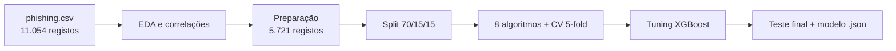
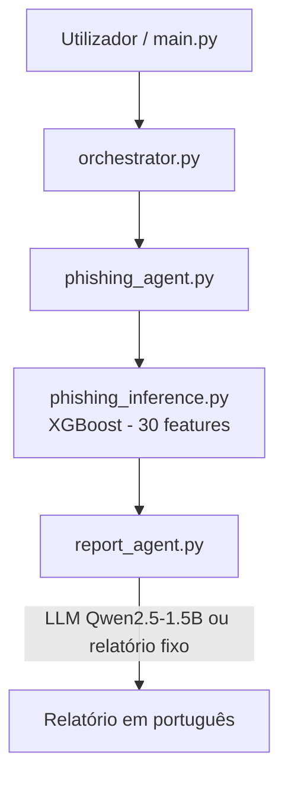

# 📐 Arquitetura — Módulo de Phishing

## Diagrama 1: Pipeline (CRISP-ML)

```mermaid
flowchart LR
    A[phishing.csv<br/>11.054 registos] --> B[EDA e correlações]
    B --> C[Preparação<br/>5.721 registos]
    C --> D[Split 70/15/15]
    D --> E[8 algoritmos + CV 5-fold]
    E --> F[Tuning XGBoost]
    F --> G[Teste final + modelo .json]
```

## Diagrama 2: Inferência e agentes

```mermaid
graph TD
    U[Utilizador / main.py] --> O[orchestrator.py]
    O --> A[phishing_agent.py]
    A --> I[phishing_inference.py<br/>XGBoost - 30 features]
    I --> R[report_agent.py]
    R -->|LLM Qwen2.5-1.5B ou relatório fixo| OUT[Relatório em português]
```
