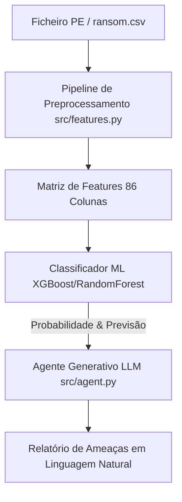
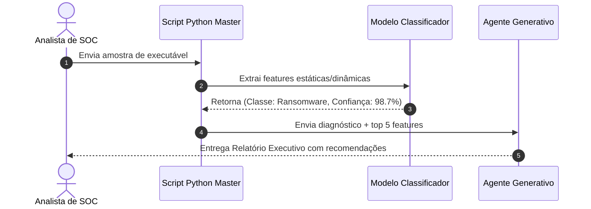

# 📐 Arquitetura do Sistema Multiagente & Pipeline

## Diagrama 1: Arquitetura Global do Sistema

```mermaid
graph TD
    A[Ficheiro PE / ransom.csv] --> B[Pipeline de Preprocessamento src/features.py]
    B --> C[Matriz de Features 86 Colunas]
    C --> D[Classificador ML XGBoost/RandomForest]
    D -->|Probabilidade & Previsão| E[Agente Generativo LLM src/agent.py]
    E --> F[Relatório de Ameaças em Linguagem Natural]
```

## Diagrama 2: Fluxo do Caso de Uso de Segurança

```mermaid
sequenceDiagram
    autonumber
    actor Analista as Analista de SOC
    participant System as Script Python Master
    participant ML as Modelo Classificador
    participant LLM as Agente Generativo

    Analista->>System: Envia amostra de executável
    System->>ML: Extrai features estáticas/dinâmicas
    ML-->>System: Retorna (Classe: Ransomware, Confiança: 98.7%)
    System->>LLM: Envia diagnóstico + top 5 features
    LLM-->>Analista: Entrega Relatório Executivo com recomendações
```